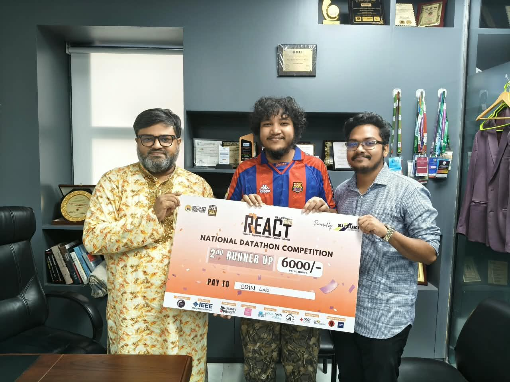

# REACT 2026 Datathon: Temporal Fraud Detection

> 🏆 **2nd Runner-Up, REACT 2026 Datathon** (Team Coin Lab)

<p align="center">
  
  <br>
  <em>Receiving the 2nd Runner-Up prize at the REACT 2026 National Datathon Competition, organised by the IEEE SEU Student Branch, Southeast University.</em>
</p>

The solution is an efficient pipeline built only from small machine-learning models. It detects fraudulent transactions in a
time-ordered payment stream. Two gradient-boosted tree models and a compact tabular neural network are
trained on 250 hand-built, leakage-free features and combined with a rank blend.

- **CPU only:** the full pipeline runs in about 73 minutes, with no GPU.
- **No pre-trained or large language models.**
- **No external data:** it uses only the competition files.
- **Reproducible:** a single notebook that runs top to bottom with fixed seeds.

---

## Problem

| | |
|---|---|
| **Training data** | 731,942 labelled transactions, 1 Jan to 15 Jul 2026 |
| **Test data** | 262,648 transactions, 16 Jul to 15 Sep 2026 |
| **Fraud rate** | 1.76% |
| **Metric** | Average precision (PR-AUC) |

The test window lies up to 62 days beyond the last label, so the core difficulty is forecasting
into the future under drift rather than fitting a random split.

## Results (time-based validation)

| Model | Horizon fold | Recent fold | Selection score |
|---|---|---|---|
| LightGBM (all features) | 0.7528 | 0.6149 | 0.6632 |
| LightGBM (label-free) | 0.7485 | 0.6128 | 0.6603 |
| CatBoost | 0.7535 | 0.6151 | 0.6635 |
| Tabular MLP | 0.7516 | 0.6148 | 0.6627 |
| **Rank blend** | **0.7568** | **0.6181** | **0.6666** |

The selection score is 0.35 × horizon + 0.65 × recent. The blend outperforms every single model on both folds.

## Approach

```
raw transactions ─► causal features (250) ─► rule mining (+14) ─► 4 models ─► rank blend ─► submission
                                                                     ▲
                                              staleness probe ───────┘ (adds a label-free member)
```

1. **Causal feature engineering.** Each feature for a row uses only rows that happened strictly
   before it. The feature families cover:
   - customer spending profile and transaction velocity (5 minutes to 30 days)
   - transaction tempo
   - familiarity with the device, merchant and location
   - how fast devices and merchants pick up new accounts
   - physically impossible movement between locations
   - how concentrated each customer's history is (Herfindahl index)
   - smoothed and time-decayed target encodings
2. **Drift-robust design.** Volumes are expressed as shares of concurrent platform traffic,
   lifetime counts are capped, and tenure is replaced with short-horizon indicators. Without this,
   features would drift out of the training range during the test window.
3. **Time-based validation with an embargo.** There are two forward-in-time folds:
   - *horizon* uses the same 62-day forecasting distance as the test window.
   - *recent* has the content closest to the test window, behind a 30-day embargo.
4. **Rule mining.** A threshold scan finds 12 rules with precision between 0.94 and 1.00.
   Together they cover **39.9% of all fraud** while firing on only 1.6% of transactions, and
   they are passed to the models as explicit features.
5. **Staleness probe.** At test time the target encodings stop updating and become up to 62 days
   out of date. Refitting with encodings frozen at the cutoff costs **about 0.018 AP**, a gap
   that ordinary validation cannot see. As a hedge, a fourth member is added that uses no target
   encodings at all.
6. **Blend and refit.** Coordinate ascent sets the blend weights. Each member is then refitted on the
   full history with two seeds.

## Why it is efficient

Components were removed when measurement showed they added nothing:

| Removed | Measured reason |
|---|---|
| Third validation fold | Scored the same rows as an existing fold |
| Adversarial drift probe | Pruned zero features in two consecutive runs |
| Exhaustive blend-weight grid | Cost 795 s per run and matched equal weights to within 0.0001 |
| Deep CatBoost (depth 8) | No gain over depth 6 |

## Repository structure

```
.
├── team-coin-lab.ipynb   # full pipeline: features, validation, models, blend, submission
├── assets/
│   └── award.jpg        # prize photo
└── README.md
```

## How to run

1. Download the competition data (`train.csv`, `test.csv`, `sample_submission.csv`) from the
   REACT 2026 Datathon Kaggle page. The data is not redistributed here.
2. Place the files in `./data/`, or run the notebook on Kaggle with the competition attached.
3. Install the dependencies:
   ```bash
   pip install numpy pandas scipy scikit-learn lightgbm catboost torch
   ```
4. Run `team-coin-lab.ipynb` from top to bottom. It writes `submission.csv` (the blend) and a
   second entry from the label-free model.

Tested with Python 3.12 on a CPU-only Kaggle kernel.

## Tech stack

Python · pandas · NumPy · LightGBM · CatBoost · PyTorch · scikit-learn
